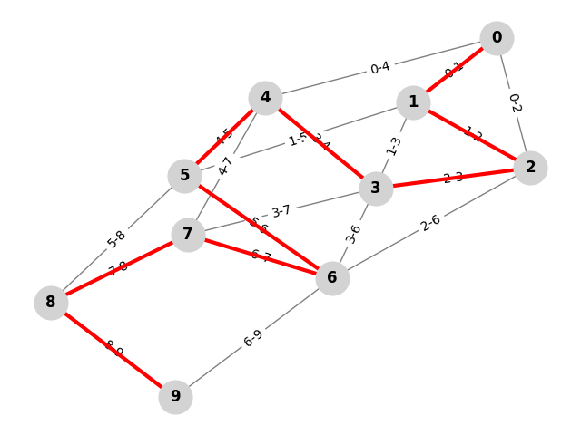

# Hamiltonian Path Finder Algorithm

Simple Python implementation of a Hamiltonian Path finder algorithm using backtracking, built as an assignment for the **Foundations of Algorithm Design and Analysis** course at PUC Minas university.

## About

This project implements an algorithm in Python to find a **Hamiltonian Path** in a given graph, using the [backtracking](https://en.wikipedia.org/wiki/Backtracking) approach. A **Hamiltonian Path** is a path that visits each vertex exactly once. If the path forms a cycle (starts and ends at the same vertex), it is called a **Hamiltonian Cycle**.

You can read more about Hamiltonian path problem [here](https://en.wikipedia.org/wiki/Hamiltonian_path_problem).

---

The image below, generated by `view.py`, represents a graph with a Hamiltonian path. The red line indicates the Hamiltonian path found by the algorithm.



## Structure

This repository contains three `.py` files:

- `hamiltonian.py`: Contains the implementation of the Hamiltonian path finder algorithm.
- `test.py`: Contains unit tests for the algorithm.
- `view.py`: Generates a visualization of a graph with an Hamiltonian path highlighted.

## How to run

You need to have Python 3 installed on your machine to run the code.

To run the example program, you can use the following command:

```bash
python3 main.py
```

To run the unit tests, you can use the following command:

```bash
python3 test_hamiltonian.py
```

## Problem Complexity Class

The Hamiltonian Path Problem belongs to the NP-Complete class of problems. This means:

- It is in **NP**: given a proposed path, we can verify in polynomial time whether it is a valid Hamiltonian Path.
- It is **NP-Hard**: solving it is at least as hard as any problem in NP.
- It is **NP-Complete**: both in NP and NP-Hard.

This classification is justified by the fact that the problem has no known polynomial-time solution, but any valid solution can be efficiently verified.

The Hamiltonian Path problem is closely related to the Traveling Salesman Problem (TSP), which is NP-Hard in its optimization form. When the TSP is treated as a [decision problem](https://en.wikipedia.org/wiki/Decision_problem), it becomes NP-Complete, just like the Hamiltonian Path problem.

## Time Complexity

The algorithm uses a [backtracking](https://en.wikipedia.org/wiki/Backtracking) approach to search for a Hamiltonian Path by exploring all possible vertex sequences.

Let $`n`$ be the number of vertices in the graph.

- In the worst case, the algorithm tries all permutations of the vertices to find a valid Hamiltonian Path.
- There are $`n!`$ possible permutations, and for each permutation, the algorithm checks if an edge exists between every pair of consecutive vertices.

Therefore, the time complexity is $`O(n!)`$.

The factorial time complexity grows even faster than exponential, making it impractical for large graphs.

## Master's Theorem

The [Master’s Theorem](https://en.wikipedia.org/wiki/Master_theorem_(analysis_of_algorithms)) is a tool used to analyze the time complexity of divide-and-conquer algorithms that follow a recurrence of the form:

$`T(n) = a ⋅ T(n/b) + f(n)`$

Where:
- $`a`$ is the number of subproblems,
- $`n/b`$ is the size of each subproblem, and
- $`f(n)`$ is the time spent on dividing the problem and combining the results.

However, the backtracking algorithm used to solve the Hamiltonian Path problem **does not follow this recursive pattern**. Instead of dividing the problem into smaller independent subproblems of equal size, the algorithm explores a **single recursive path** through a **decision tree**, trying all possible combinations of vertices until a valid path is found (or all are exhausted).

Specifically:
- There is **no consistent branching factor** $`a`$ and **no reduction in input size** by a fixed factor `b`.
- Each recursive call continues with a reduced candidate set, but not a fractional portion of the input.
- The recursion forms a **combinatorial tree** of depth $`n`$, not a logarithmic or polynomial one as in divide-and-conquer.

Thus, the structure of the algorithm's recursion **does not fit the assumptions of the Master’s Theorem**, making it inapplicable for analyzing this problem’s time complexity.

## Case Analysis

**Worst Case:**

- The graph is sparse or has no Hamiltonian Path.
- The algorithm explores all n! permutations without finding a valid path.
- Time: $`O(n!)`$

**Average Case:**

- Depends on the graph's density and the order of vertex traversal.
- On average, the algorithm explores a subset of all permutations before finding a solution or determining none exists.
- Time: Between $`O(n)`$ and $`O(n!)`$, no precise formula.

**Best Case:**

- A Hamiltonian Path is found in the very first recursive calls.
- For example, the first tried permutation is valid.
- Time: $`O(n)`$ (only one path is validated successfully).